# Game Compatibility

LAV programs in the local validation corpus were run by the standalone
emulator with default capture timing (300 frames). Every screenshot below
is the indexed-color framebuffer produced by guest execution. If a program
stops, times out, or leaves a single-color framebuffer, the batch does not
create a screenshot. A successful startup capture does not guarantee that
every screen or gameplay path works correctly.

## Supported Program Profile

The current core recognizes LavaX bytecode programs with the standard LAV
file header. It implements the VM subsets needed for stack-based execution,
indexed-color display, keyboard/pointer input, virtual file system access,
and basic system API services.

Validated behavior includes program initialization, startup screens, display
rendering, keyboard input, and continued frame execution.

## Summary

| Status | Count |
| --- | ---: |
| ✅ Pass | 266 |
| ❌ Fail | 1 |
| **Total** | **267** |

## Application List

| # | Application | Screenshot | Status |
| ---: | --- | --- | --- |
| 1 | 105 |  | ✅ Pass |
| 2 | 3D迷宫 | 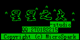 | ✅ Pass |
| 3 | 9stars |  | ✅ Pass |
| 4 | BoBo_MJ |  | ✅ Pass |
| 5 | Bobo_Dance | 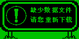 | ✅ Pass |
| 6 | BomB |  | ✅ Pass |
| 7 | CFM | 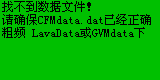 | ✅ Pass |
| 8 | CS蓝色行动 |  | ✅ Pass |
| 9 | Clear | 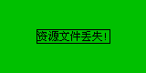 | ✅ Pass |
| 10 | Cs(lav)1_3 | 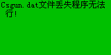 | ✅ Pass |
| 11 | EMStory | 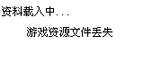 | ✅ Pass |
| 12 | EM星纪传说—格斗 | 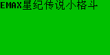 | ✅ Pass |
| 13 | Eagle |  | ✅ Pass |
| 14 | F2 | 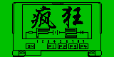 | ✅ Pass |
| 15 | Fighter | 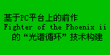 | ✅ Pass |
| 16 | Fivet |  | ✅ Pass |
| 17 | For Computer（模拟器用） |  | ✅ Pass |
| 18 | G.龙之崛起 | 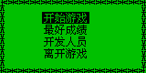 | ✅ Pass |
| 19 | HFAcs |  | ✅ Pass |
| 20 | Hero | 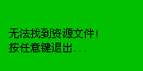 | ✅ Pass |
| 21 | Hit |  | ✅ Pass |
| 22 | IQ大作战 | 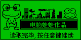 | ✅ Pass |
| 23 | Jackal | 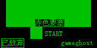 | ✅ Pass |
| 24 | Just_Fly | 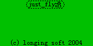 | ✅ Pass |
| 25 | L.龙之崛起 |  | ✅ Pass |
| 26 | LF_demo(PC) |  | ✅ Pass |
| 27 | LF_demo |  | ✅ Pass |
| 28 | Land |  | ✅ Pass |
| 29 | LazyYY |  | ✅ Pass |
| 30 | Liuye |  | ✅ Pass |
| 31 | Love_I |  | ✅ Pass |
| 32 | Magic |  | ✅ Pass |
| 33 | MahJong |  | ✅ Pass |
| 34 | MapEditor |  | ✅ Pass |
| 35 | Moon |  | ✅ Pass |
| 36 | NC2600 | 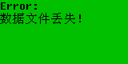 | ✅ Pass |
| 37 | NC3000 |  | ✅ Pass |
| 38 | PACMAN | 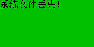 | ✅ Pass |
| 39 | PM2 | 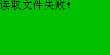 | ✅ Pass |
| 40 | PM4 |  | ✅ Pass |
| 41 | PTV1.0 |  | ✅ Pass |
| 42 | Pala | 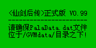 | ✅ Pass |
| 43 | Pala_ |  | ✅ Pass |
| 44 | Pala_TC800 | 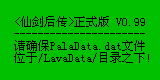 | ✅ Pass |
| 45 | Psheep |  | ✅ Pass |
| 46 | QUEERBOX |  | ✅ Pass |
| 47 | Q版Dancer |  | ✅ Pass |
| 48 | RC赛车 |  | ✅ Pass |
| 49 | Rush_Out_For_Lava(8K) | 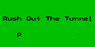 | ✅ Pass |
| 50 | Rush_Out_For_Lava1(16k) |  | ✅ Pass |
| 51 | Rush_Out_For_Lava2(16k) | 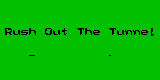 | ✅ Pass |
| 52 | SCGO_219 | 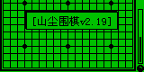 | ✅ Pass |
| 53 | SCGO_219_16gray | 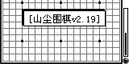 | ✅ Pass |
| 54 | SRW-2 | 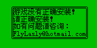 | ✅ Pass |
| 55 | SRW |  | ✅ Pass |
| 56 | SRWDate |  | ✅ Pass |
| 57 | SWR无延时 | 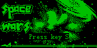 | ✅ Pass |
| 58 | SWR有延时 |  | ✅ Pass |
| 59 | Shengjin2 |  | ✅ Pass |
| 60 | SnowFight | 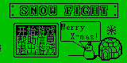 | ✅ Pass |
| 61 | SpaceWar | 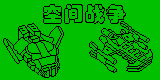 | ✅ Pass |
| 62 | Sword |  | ✅ Pass |
| 63 | TC1000 |  | ✅ Pass |
| 64 | TC1000S |  | ✅ Pass |
| 65 | TC808 |  | ✅ Pass |
| 66 | WZLZ_16灰度 | 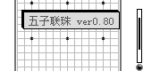 | ✅ Pass |
| 67 | WZLZ_黑白 | 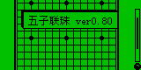 | ✅ Pass |
| 68 | WarCraft |  | ✅ Pass |
| 69 | Wing |  | ✅ Pass |
| 70 | Yahtzee | 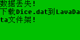 | ✅ Pass |
| 71 | YoGamesPC |  | ✅ Pass |
| 72 | YoGamesWQX |  | ✅ Pass |
| 73 | allout | 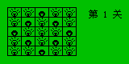 | ✅ Pass |
| 74 | boxing |  | ✅ Pass |
| 75 | cloud_all-2 |  | ✅ Pass |
| 76 | cloud_all |  | ✅ Pass |
| 77 | crazyball-2 | 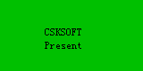 | ✅ Pass |
| 78 | crazyball | 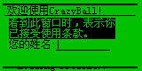 | ✅ Pass |
| 79 | dzl | 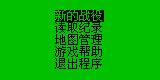 | ✅ Pass |
| 80 | game | 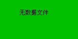 | ✅ Pass |
| 81 | gcdmx |  | ✅ Pass |
| 82 | l2体验版 |  | ✅ Pass |
| 83 | longX | 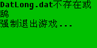 | ✅ Pass |
| 84 | mapedit-2 |  | ✅ Pass |
| 85 | mapedit | 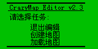 | ✅ Pass |
| 86 | maze2 |  | ✅ Pass |
| 87 | mywar1 | 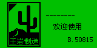 | ✅ Pass |
| 88 | pokemon | 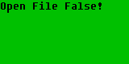 | ✅ Pass |
| 89 | sudoku | 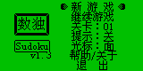 | ✅ Pass |
| 90 | travel |  | ✅ Pass |
| 91 | tunshi_V0.29 | 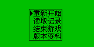 | ✅ Pass |
| 92 | wangwang | 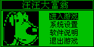 | ✅ Pass |
| 93 | wind | 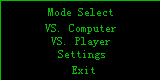 | ✅ Pass |
| 94 | world-2 |  | ✅ Pass |
| 95 | world |  | ✅ Pass |
| 96 | world2 |  | ✅ Pass |
| 97 | world2_16 |  | ✅ Pass |
| 98 | 《英雄无敌2》完美版 | 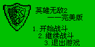 | ✅ Pass |
| 99 | 【煞魔剑】 正式版 |  | ✅ Pass |
| 100 | 七彩泡泡 | 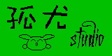 | ✅ Pass |
| 101 | 七彩连珠 | 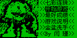 | ✅ Pass |
| 102 | 七王五二三 | 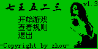 | ✅ Pass |
| 103 | 中国灯谜 | 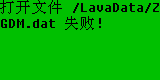 | ✅ Pass |
| 104 | 中国烟火 |  | ✅ Pass |
| 105 | 中国麻将 |  | ✅ Pass |
| 106 | 中学传奇 |  | ✅ Pass |
| 107 | 五子连珠 | 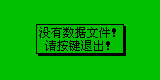 | ✅ Pass |
| 108 | 仙境 |  | ✅ Pass |
| 109 | 仙境奇缘 |  | ✅ Pass |
| 110 | 任意拼图 |  | ✅ Pass |
| 111 | 俄罗斯扑克 | 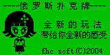 | ✅ Pass |
| 112 | 俄罗斯方块灰 |  | ✅ Pass |
| 113 | 俄罗斯方块黑 |  | ✅ Pass |
| 114 | 假日神秘岛 abcdef |  | ✅ Pass |
| 115 | 元素周期 |  | ✅ Pass |
| 116 | 先赌★为快 |  | ✅ Pass |
| 117 | 冒险岛IV-2 |  | ✅ Pass |
| 118 | 冒险岛IV |  | ✅ Pass |
| 119 | 决战娜美克 |  | ✅ Pass |
| 120 | 凌空抽射v1.5 |  | ✅ Pass |
| 121 | 勇者传说 |  | ✅ Pass |
| 122 | 勇者斗恶龙-2 |  | ✅ Pass |
| 123 | 勇者斗恶龙 |  | ✅ Pass |
| 124 | 勇闯地狱 |  | ✅ Pass |
| 125 | 博士失踪记 |  | ✅ Pass |
| 126 | 口水王2-2 |  | ✅ Pass |
| 127 | 口水王2 |  | ✅ Pass |
| 128 | 吃月饼 |  | ✅ Pass |
| 129 | 困虫斗 |  | ✅ Pass |
| 130 | 圈地运动 |  | ✅ Pass |
| 131 | 坦克2004 |  | ✅ Pass |
| 132 | 大家来找茬 |  | ✅ Pass |
| 133 | 天虫即时 |  | ✅ Pass |
| 134 | 天虫即时vs |  | ✅ Pass |
| 135 | 太空寻宝 |  | ✅ Pass |
| 136 | 太空战舰 |  | ✅ Pass |
| 137 | 存档转化器_山尘围棋 |  | ✅ Pass |
| 138 | 宇宙大战 |  | ✅ Pass |
| 139 | 宠世L_1K |  | ✅ Pass |
| 140 | 宠世L_1KS |  | ✅ Pass |
| 141 | 宠世L_2K6 |  | ✅ Pass |
| 142 | 宠世L_3K |  | ✅ Pass |
| 143 | 宠世L_808 |  | ✅ Pass |
| 144 | 宠世导出入 |  | ✅ Pass |
| 145 | 宠物世界1K |  | ✅ Pass |
| 146 | 宠物世界1S |  | ✅ Pass |
| 147 | 宠物世界26 |  | ✅ Pass |
| 148 | 宠物世界3K |  | ✅ Pass |
| 149 | 宠物世界80 |  | ✅ Pass |
| 150 | 宠物世界88 |  | ✅ Pass |
| 151 | 密室杀机 |  | ✅ Pass |
| 152 | 富甲天下 |  | ✅ Pass |
| 153 | 对战方块 |  | ✅ Pass |
| 154 | 小猴过河 |  | ✅ Pass |
| 155 | 山尘围棋v2 |  | ✅ Pass |
| 156 | 山村淘金记 |  | ✅ Pass |
| 157 | 帝国传-2 |  | ✅ Pass |
| 158 | 帝国传 |  | ✅ Pass |
| 159 | 幕天助手 |  | ✅ Pass |
| 160 | 幕天席地 |  | ✅ Pass |
| 161 | 幕天席地2 |  | ✅ Pass |
| 162 | 幕天席地3_plus |  | ✅ Pass |
| 163 | 平面魔方 |  | ✅ Pass |
| 164 | 幻影战机 |  | ✅ Pass |
| 165 | 强力钻土机(Tc800) |  | ✅ Pass |
| 166 | 强力钻土机(其它机型) |  | ✅ Pass |
| 167 | 强力钻土机(模拟器) |  | ✅ Pass |
| 168 | 心跳回忆 |  | ✅ Pass |
| 169 | 忍う者 |  | ✅ Pass |
| 170 | 我的世界-2 |  | ✅ Pass |
| 171 | 我的世界 |  | ✅ Pass |
| 172 | 战略1号 |  | ✅ Pass |
| 173 | 扑克21 |  | ✅ Pass |
| 174 | 扑克大战 |  | ✅ Pass |
| 175 | 打飞机 |  | ✅ Pass |
| 176 | 扫雷 |  | ✅ Pass |
| 177 | 扳手腕 |  | ✅ Pass |
| 178 | 护卫战舰 |  | ✅ Pass |
| 179 | 拿火柴 |  | ✅ Pass |
| 180 | 挑战推箱子 |  | ✅ Pass |
| 181 | 接水管 |  | ✅ Pass |
| 182 | 推箱达人 |  | ✅ Pass |
| 183 | 搬运工-2 |  | ✅ Pass |
| 184 | 搬运工 |  | ✅ Pass |
| 185 | 撞球高手 |  | ✅ Pass |
| 186 | 数电模拟器 |  | ✅ Pass |
| 187 | 文曲星版Zelda |  | ✅ Pass |
| 188 | 旋转老虎机 |  | ✅ Pass |
| 189 | 无底洞 |  | ✅ Pass |
| 190 | 星剑传奇 |  | ✅ Pass |
| 191 | 星剑注册 |  | ✅ Pass |
| 192 | 是男人就下100层 |  | ✅ Pass |
| 193 | 是男人就撑20秒正式版 |  | ✅ Pass |
| 194 | 是男人就飞10000米 |  | ✅ Pass |
| 195 | 暗子象棋 |  | ✅ Pass |
| 196 | 极速狂飙 |  | ✅ Pass |
| 197 | 极限斗地主-2 |  | ✅ Pass |
| 198 | 极限斗地主 |  | ✅ Pass |
| 199 | 极限斗地主NC1020版 |  | ✅ Pass |
| 200 | 极限斗地主tc800版 |  | ✅ Pass |
| 201 | 梦中世界 |  | ✅ Pass |
| 202 | 梦幻21点 |  | ✅ Pass |
| 203 | 梦幻mario |  | ✅ Pass |
| 204 | 橡皮屋 |  | ✅ Pass |
| 205 | 欢乐五子棋 |  | ✅ Pass |
| 206 | 武侠 |  | ✅ Pass |
| 207 | 水管工-2 |  | ✅ Pass |
| 208 | 水管工 |  | ✅ Pass |
| 209 | 流星蝴蝶剑 |  | ✅ Pass |
| 210 | 海淀浮生记 |  | ✅ Pass |
| 211 | 海盗船 |  | ✅ Pass |
| 212 | 滑雪 |  | ✅ Pass |
| 213 | 火箭车 |  | ✅ Pass |
| 214 | 灵剑射击 |  | ✅ Pass |
| 215 | 炸潜艇v1.1 2007.7.6 |  | ✅ Pass |
| 216 | 煞魔剑A |  | ✅ Pass |
| 217 | 爬虫大陆 |  | ✅ Pass |
| 218 | 猫狗大战Ⅱ |  | ✅ Pass |
| 219 | 玩转变色龙 |  | ✅ Pass |
| 220 | 生死时速Ⅱ（修改版） |  | ✅ Pass |
| 221 | 生物钟 |  | ✅ Pass |
| 222 | 疯狂跳棋 |  | ✅ Pass |
| 223 | 白白快跑 |  | ✅ Pass |
| 224 | 白金贪吃蛇 |  | ✅ Pass |
| 225 | 种金币 |  | ✅ Pass |
| 226 | 秘境还生 |  | ✅ Pass |
| 227 | 空当接龙 |  | ✅ Pass |
| 228 | 精灵岛5 |  | ✅ Pass |
| 229 | 绝对下落 |  | ✅ Pass |
| 230 | 花之精灵 |  | ✅ Pass |
| 231 | 英雄无敌v1.0 |  | ✅ Pass |
| 232 | 萝卜大作战 |  | ✅ Pass |
| 233 | 蛙蛙大富翁 |  | ✅ Pass |
| 234 | 蛙蛙马戏团 |  | ✅ Pass |
| 235 | 蜀山注册 |  | ✅ Pass |
| 236 | 蜀山群侠传 |  | ✅ Pass |
| 237 | 蟑螂历险记 V1.0 |  | ✅ Pass |
| 238 | 蟑螂历险记V2.0 |  | ✅ Pass |
| 239 | 蟑螂历险记V3.0 |  | ✅ Pass |
| 240 | 蟑螂历险记V3.2-2 |  | ✅ Pass |
| 241 | 蟑螂历险记V3.2 |  | ✅ Pass |
| 242 | 衰 |  | ✅ Pass |
| 243 | 象棋90 |  | ✅ Pass |
| 244 | 象素画册 |  | ✅ Pass |
| 245 | 贪吃蛇鲍勃 |  | ✅ Pass |
| 246 | 资源管理器 |  | ✅ Pass |
| 247 | 超级舞者 |  | ✅ Pass |
| 248 | 过关画面 |  | ✅ Pass |
| 249 | 连连看-2 |  | ✅ Pass |
| 250 | 连连看 |  | ✅ Pass |
| 251 | 逆转裁判 |  | ✅ Pass |
| 252 | 通关动画 |  | ✅ Pass |
| 253 | 钻石方块灰 |  | ✅ Pass |
| 254 | 钻石方块黑 |  | ✅ Pass |
| 255 | 钻石棋 |  | ✅ Pass |
| 256 | 雪人传奇 |  | ✅ Pass |
| 257 | 零度恐惧 |  | ✅ Pass |
| 258 | 青蛙冒险 |  | ✅ Pass |
| 259 | 飞翔理科1020 |  | ✅ Pass |
| 260 | 飞行棋 |  | ✅ Pass |
| 261 | 魔塔 |  | ✅ Pass |
| 262 | 魔塔整合版 |  | ✅ Pass |
| 263 | 魔法方块 |  | ✅ Pass |
| 264 | 魔法纪元 |  | ✅ Pass |
| 265 | 魔界传说 |  | ✅ Pass |
| 266 | 黑白牛牛 |  | ✅ Pass |

## Known Limitations

- The emulator is in early development; some system APIs are not yet
  implemented.
- Audio playback is not yet implemented.
- Not all 87 system API services are fully implemented.
- Some programs may require specific system API behaviors that are not
  yet supported.
- Compatibility with all LavaX bytecode variants is not guaranteed.
- One program failed with "invalid LavaX opcode 0x00 at program offset 0x72".

## Reporting a Compatibility Issue

Include the program name, the last visible screen, the input that triggers
the problem, and any error text. When possible, reproduce it with headless
mode:

```bash
lavaxemu path/to/game.lav --headless --frames 600 --screenshot frame.png
```

Set `RUST_LOG=debug` to enable verbose logging. Do not attach copyrighted
game files to public issue reports.

## Adding New Programs

To add a new program to the compatibility list:

1. Place the `.lav` file in the validation directory
2. Run the batch screenshot script:
   ```powershell
   pwsh scripts/batch-screenshots.ps1
   ```
3. Verify the screenshot shows a valid game screen
4. Add an entry to the Application List table above
5. Update the Summary counts
